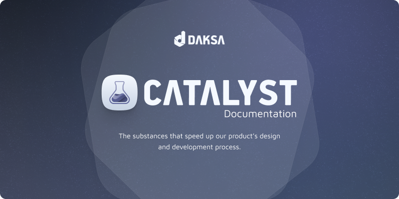

[](https://github.com/rulyardiansyah/catalyst-doc)

--

## 🛠 Setup

Dokumentasi Catalyst ini menggunakan template [Starlight](https://starlight.astro.build) dari [Astro](https://astro.build/). Untuk menjalankan dokumentasi ini di lokal, clone terlebih dahulu repository ini.

1. Di dalam direktori hasil clone tersebut, ketikan command `npm i` atau `npm install` untuk meng-install semua dependencies yang dibutuhkan.
2. Ketikkan command `npm run dev` untuk menjalankan repo ini di server lokal.
3. Buka `http://localhost:4321` pada address bar browser.
4. Selesai. 😅

--

## 🚀 Struktur Project

Secara umum, di dalam direktori `catalyst-doc` ini, Anda akan melihat folder dan file berikut:

```
.
├── public/
├── src/
│   ├── assets/
│   ├── content/
│   │   ├── docs/
│   └── content.config.ts
├── astro.config.mjs
├── package.json
└── tsconfig.json
```

Starlight akan mencari file `.md` atau `.mdx` di dalam direktori `src/content/docs/`. Setiap file ini akan di-expose sebagai route berdasarkan nama file.

Gambar dapat ditambahkan di `src/assets/` dan di-embed dalam Markdown dengan link relatif.

--

## 📋 Daftar Command

Semua command di bawah ini dijalankan root direktori `./catalyst-doc`.

| Command                   | Action                                           |
| :------------------------ | :----------------------------------------------- |
| `npm install`             | Installs dependencies                            |
| `npm run dev`             | Starts local dev server at `localhost:4321`      |
| `npm run build`           | Build your production site to `./dist/`          |
| `npm run preview`         | Preview your build locally, before deploying     |
| `npm run astro ...`       | Run CLI commands like `astro add`, `astro check` |
| `npm run astro -- --help` | Get help using the Astro CLI                     |


